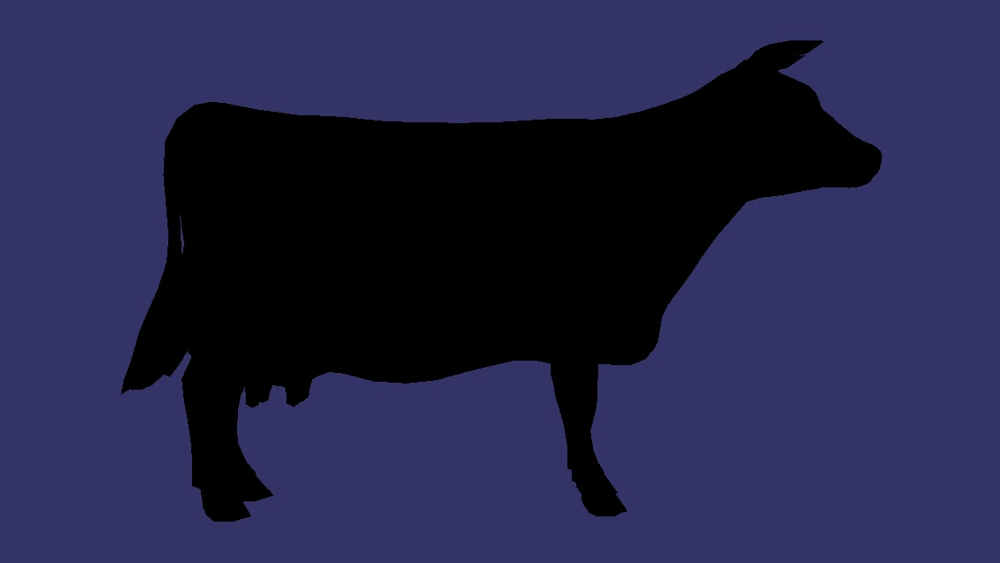
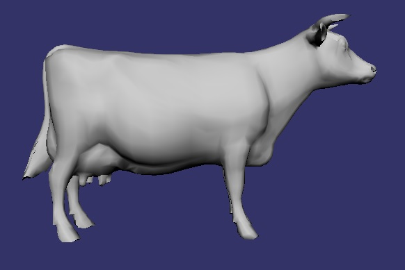
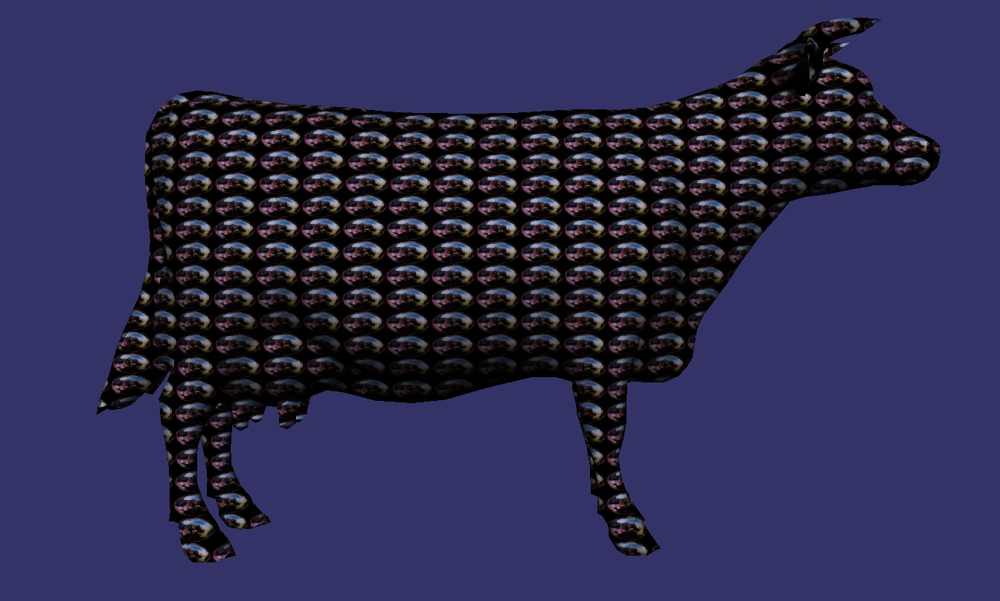
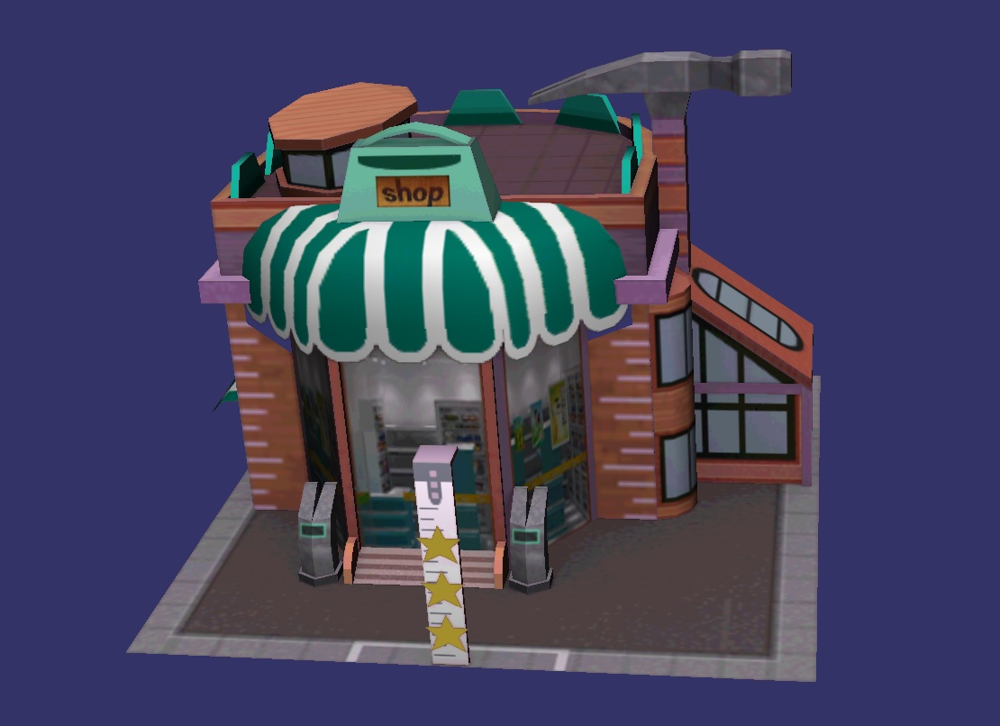

OpenSceneGraph使用`OSG_GL3_AVAILABLE`开关编译后，默认的`osgViewer`已经不能很好的观察牛`cow.osg`了。

# GL3开关

## 初始情况

OpenSceneGraph编译时打开`OSG_GL3_AVAILABLE`开关，所有`OpenGL3.0`以前的固定渲染管线都不好用了，用`osgViewer cow.osg`时只能看到一个黑牛



并且还不断提示

```
Warning: Material::apply(State&) - not supported.
Warning: Material::apply(State&) - not supported.
Warning: detected OpenGL error 'invalid enumerant' at after RenderBin::draw(..)
```

用`osgsimplegl3`示例查看的话，会得到一个白牛，但仍然有提示。



为此，设置一个`InfoVisitor`节点访问器，去除材质。

```
    auto m = ss->getAttribute(osg::StateAttribute::MATERIAL, 0);
    if(m) ss->removeAttribute(osg::StateAttribute::MATERIAL, 0);
```

从此，再也没有警告提醒了。

## 材质

警告提示是因为`OpenGL`材质`Material`在`OpenGL3`以后的渲染管线里已经不存在了。为此，可行的办法是将其剔除。建立一个`InfoVisitor`来处理。见`demo/osgl3`。

## 纹理

`OSG`这个`cow.osg`牛模型虽然提供了纹理坐标，但原始值都是0，无法采样纹理，所以牛为白色。

当加上纹理坐标后，就可显示一个有纹理的牛了。例如使用顶点坐标为纹理坐标，得到花牛。

```
texCoord = osg_MultiTexCoord0.xy;
```



这里怎么处理纹理才能得到`OSG_GL3_AVAILABLE`开启以前的牛效果还没搞清楚。

对于有纹理坐标的模型是能得到正确结果的。

```
//vert shader
#version 330 
uniform mat4 osg_ModelViewProjectionMatrix; 
uniform mat3 osg_NormalMatrix; 
uniform vec3 ecLightDir; 
uniform float osg_FrameTime;

in vec4 osg_Vertex; 
in vec4 osg_Color;
in vec3 osg_Normal; 
in vec4 osg_MultiTexCoord0;
out vec4 color; 
out vec2 texCoord;
 
void main() 
{ 
    vec3 ecNormal = normalize( osg_NormalMatrix * osg_Normal ); 
    float diffuse = max( dot( ecLightDir, ecNormal ), 0. ); 
    color = vec4( vec3( diffuse ), 1. );      
    gl_Position = osg_ModelViewProjectionMatrix * osg_Vertex; 
    texCoord = osg_MultiTexCoord0.xy;
} 

//fragment shader
#version 330 
uniform sampler2D baseTexturex;
in vec2 texCoord;
in vec4 color; 
out vec4 fragData; 
void main() 
{ 
    fragData = color*texture(baseTexturex, texCoord);
}

```



对于这个模型，`osgViewer`也能得到很好的渲染效果，只是不去除材质的话，会有很多警告输出。

# 着色器内置变量

根据`StateSet`定义，示例等

## uniform变量

osg着色器的内置uniform变量如下

```
uniform int osg_FrameNumber：当前OSG程序运行的帧数；
uniform float osg_FrameTime：当前OSG程序的运行总时间；
uniform float osg_DeltaFrameTime：当前OSG程序运行每帧的间隔时间；
uniform mat4 osg_ViewMatrix：当前OSG摄像机的观察矩阵；
uniform mat4 osg_ViewMatrixInverse：当前OSG摄像机观察矩阵的逆矩阵。
uniform mat4 osg_ModelViewMatrix：内置gl_ModelViewMatrix
uniform mat4 osg_ModelViewProjectionMatrix：内置gl_ModelViewProjectionMatrix
uniform mat4 osg_ProjectionMatrix：内置gl_ProjectionMatrix
uniform mat3 osg_NormalMatrix：内置gl_NormalMatrix
```

## 顶点数组

osg着色器的内置顶点数组如下

```
in vec4 osg_Vertex; 
in vec4 osg_Color;
in vec3 osg_Normal; 
in vec4 osg_MultiTexCoord0;
```

## 采样器

OSG着色器的内置采样器如下

```
uniform sampler2D baseTexturex;
```

